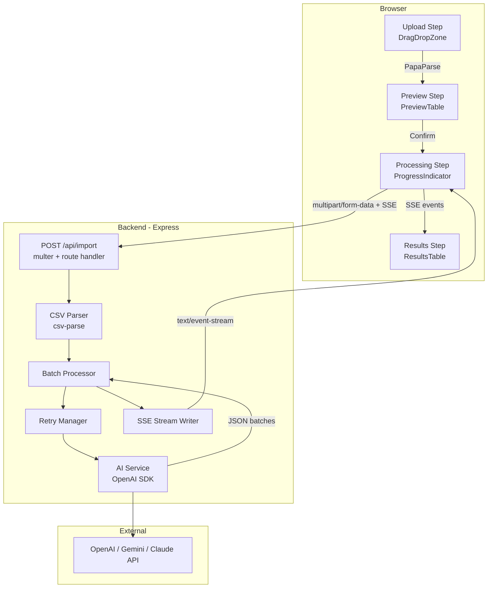

# Design Document — AI CSV Importer

## Overview

The AI CSV Importer is a full-stack feature for GrowEasy CRM that lets users upload lead data in any CSV format and receive structured CRM records via AI-powered field extraction. The system is composed of a Next.js 14 frontend and a Node.js/Express backend, connected via a single `POST /api/import` endpoint that streams progress through Server-Sent Events (SSE).

### Key Design Goals

- **Format-agnostic ingestion**: The AI maps arbitrary CSV columns to 15 fixed CRM fields, so users never need to rename their export files.
- **Real-time feedback**: SSE progress events keep the user informed during potentially slow LLM calls.
- **Resilience**: Exponential back-off retry handles transient LLM API errors without failing the entire import.
- **Performance at scale**: `@tanstack/react-virtual` virtualizes large tables on the frontend so 10,000-row imports remain responsive.
- **Type safety**: TypeScript strict mode throughout frontend and backend.

---

## Architecture

### High-Level System Diagram



### Four-Step Frontend Flow

```
Upload ──► Preview ──► Confirm / Processing ──► Results
  (1)         (2)              (3)                 (4)
```

Each step is a distinct React component rendered under a single page route (`/import`). A top-level state machine (React `useReducer`) governs which step is active.

---

## Components and Interfaces

### Frontend Component Tree

```
app/
└── import/
    └── page.tsx                  ← ImportPage (orchestrator, holds reducer state)
        ├── UploadStep/
        │   ├── DragDropZone.tsx  ← Drag-and-drop + file picker
        │   └── FileError.tsx     ← Inline error messages
        ├── PreviewStep/
        │   ├── PreviewTable.tsx  ← Virtualised CSV preview
        │   └── FileSummary.tsx   ← Name + row count banner
        ├── ProcessingStep/
        │   └── ProgressIndicator.tsx ← Indeterminate → determinate bar
        └── ResultsStep/
            ├── ResultsTable.tsx  ← Virtualised CRM records table
            ├── ImportSummary.tsx ← total_imported / total_skipped
            └── SkippedSection.tsx ← Expandable skipped rows list
```

#### Shared / Utility Components

```
components/
├── ThemeToggle.tsx        ← Dark/light switch
├── VirtualTable.tsx       ← Reusable @tanstack/react-virtual wrapper
└── ErrorBanner.tsx        ← Standardised error display with optional retry
```

#### Frontend Modules

```
lib/
├── csvParser.ts           ← PapaParse wrapper (browser-only)
├── apiClient.ts           ← fetch wrapper for POST /api/import + SSE consumer
├── themeManager.ts        ← localStorage + prefers-color-scheme logic
└── types.ts               ← Shared TypeScript interfaces (CrmRecord, ImportResponse, …)
```

### Backend Module Structure

```
src/
├── server.ts              ← Express app bootstrap, middleware wiring
├── routes/
│   └── importRoute.ts     ← POST /api/import route handler
├── middleware/
│   ├── multerConfig.ts    ← multer instance, 50 MB limit, CSV-only filter
│   └── errorHandler.ts    ← Global error-to-JSON middleware
├── services/
│   ├── csvParser.ts       ← csv-parse wrapper, returns row objects
│   ├── batchProcessor.ts  ← Splits rows → batches, orchestrates AI calls
│   ├── aiService.ts       ← OpenAI SDK call, prompt construction, response parse
│   └── retryManager.ts    ← Exponential back-off retry wrapper
├── streaming/
│   └── sseWriter.ts       ← SSE helpers: writeProgress(), writeFinal(), writeError()
├── types/
│   └── index.ts           ← Backend TypeScript interfaces
└── utils/
    └── logger.ts          ← Structured request logger
```

---

## Data Models

### CRM Record

```typescript
/** The 15 fixed CRM fields extracted by the AI for every imported lead. */
export interface CrmRecord {
  created_at: string;                      // ISO 8601 or empty string
  name: string;
  email: string;                           // first email; overflow → crm_note
  country_code: string;                    // e.g. "+91"
  mobile_without_country_code: string;     // first mobile; overflow → crm_note
  company: string;
  city: string;
  state: string;
  country: string;
  lead_owner: string;
  crm_status: CrmStatus;
  crm_note: string;                        // remarks + overflow emails/mobiles
  data_source: DataSource | '';
  possession_time: string;
  description: string;
}

export type CrmStatus =
  | 'GOOD_LEAD_FOLLOW_UP'
  | 'DID_NOT_CONNECT'
  | 'BAD_LEAD'
  | 'SALE_DONE';

export type DataSource =
  | 'leads_on_demand'
  | 'meridian_tower'
  | 'eden_park'
  | 'varah_swamy'
  | 'sarjapur_plots';
```

### Skipped Record

```typescript
export interface SkippedRecord {
  row_index: number;   // 0-based index in the original CSV data rows
  reason: SkipReason;
}

export type SkipReason =
  | 'no_contact_info'
  | 'ai_batch_failed'
  | 'ai_service_unavailable';
```

### Import Response

```typescript
export interface ImportResponse {
  records: CrmRecord[];
  skipped: SkippedRecord[];
  total_imported: number;   // invariant: === records.length
  total_skipped: number;    // invariant: === skipped.length
                            // invariant: total_imported + total_skipped === input rows
}
```

### SSE Progress Event

```typescript
/** Emitted after each batch completes. */
export interface ProgressEvent {
  type: 'progress';
  batches_completed: number;
  batches_total: number;
}

/** Emitted once all batches finish; carries the full import response. */
export interface FinalEvent {
  type: 'final';
  data: ImportResponse;
}

/** Emitted if a fatal error occurs before a final event. */
export interface ErrorEvent {
  type: 'error';
  error: string;
  message: string;
}

export type SseEvent = ProgressEvent | FinalEvent | ErrorEvent;
```

### API Error Response

```typescript
export interface ApiErrorResponse {
  error: string;    // machine-readable code, e.g. "missing_file"
  message: string;  // human-readable description
}
```

### Frontend State Machine

```typescript
export type ImportStep =
  | { status: 'idle' }
  | { status: 'parsing' }
  | { status: 'preview'; rows: Record<string, string>[]; fileName: string; rowCount: number }
  | { status: 'processing'; progress: ProgressState }
  | { status: 'results'; response: ImportResponse }
  | { status: 'error'; message: string; retryable: boolean };

export interface ProgressState {
  batches_completed: number;
  batches_total: number;
  indeterminate: boolean;  // true until first SSE progress event arrives
}
```

---

## API Specification

### `POST /api/import`

| Attribute          | Value                                                        |
|--------------------|--------------------------------------------------------------|
| URL                | `/api/import`                                                |
| Method             | `POST`                                                       |
| Content-Type       | `multipart/form-data`                                        |
| File field name    | `file`                                                       |
| Max file size      | 50 MB                                                        |
| Response type      | `text/event-stream` (SSE) for progress + final JSON payload  |
| Request timeout    | 120 s                                                        |

#### Request Validation Order (precedes any parsing)

1. Content-Type must be `multipart/form-data` → else HTTP 415
2. File size ≤ 50 MB → else HTTP 413 (checked by multer before parsing)
3. `file` field present → else HTTP 422 `missing_file`
4. File not empty (> 0 bytes, ≥ 1 data row after parse) → else HTTP 422
5. File parseable as CSV → else HTTP 422

#### SSE Event Format

Events are sent as `text/event-stream`. Each event is a JSON-serialised `SseEvent` on the `data:` line, followed by a blank line:

```
data: {"type":"progress","batches_completed":1,"batches_total":4}\n\n
data: {"type":"progress","batches_completed":2,"batches_total":4}\n\n
data: {"type":"final","data":{"records":[...],"skipped":[...],"total_imported":95,"total_skipped":5}}\n\n
```

#### HTTP Error Responses

| Status | `error` code           | Trigger                                            |
|--------|------------------------|----------------------------------------------------|
| 413    | `file_too_large`       | File > 50 MB                                       |
| 415    | `unsupported_media_type` | Content-Type not multipart/form-data             |
| 422    | `missing_file`         | No `file` field in multipart body                  |
| 422    | `empty_file`           | File is 0 bytes or has no data rows                |
| 422    | `invalid_csv`          | File cannot be parsed as valid CSV                 |
| 504    | `processing_timeout`   | Total processing time > 120 s                      |
| 500    | `internal_error`       | Unhandled server exception                         |

#### CORS

The backend sets `Access-Control-Allow-Origin` to the value of the `FRONTEND_ORIGIN` environment variable. Preflight `OPTIONS` requests are handled by the `cors` middleware package.

#### Health Check

`GET /health` → HTTP 200 `{ "status": "ok" }`

---

## Key Algorithms

### 1. Batch Processing

```
function processBatches(rows, sseWriter, abortSignal):
  batches = chunk(rows, 50)                        // ≤50 rows per batch
  results = { records: [], skipped: [] }

  for (i, batch) in enumerate(batches):
    if abortSignal.aborted: break

    try:
      batchResult = await retryManager.run(
        () => aiService.extractFields(batch),
        { maxAttempts: 4, backoff: [1000, 2000, 4000] }
      )
      results.records.push(...batchResult.records)
      results.skipped.push(...batchResult.skipped)
    catch (err):
      // All retries exhausted — mark entire batch as skipped
      for (j, row) in enumerate(batch):
        results.skipped.push({
          row_index: i * 50 + j,
          reason: 'ai_service_unavailable'   // or 'ai_batch_failed'
        })

    sseWriter.writeProgress(i + 1, batches.length)

  sseWriter.writeFinal(buildImportResponse(results, rows.length))
```

### 2. Retry Manager

```
async function run(fn, { maxAttempts, backoff }):
  for attempt in 1..maxAttempts:
    try:
      return await fn()
    catch (err):
      if isNonTransient(err): throw err          // 400, 401, 403, 404 — no retry
      if attempt === maxAttempts: throw err
      await sleep(backoff[attempt - 1])          // 1s, 2s, 4s

function isNonTransient(err):
  return err.status in [400, 401, 403, 404]

// Transient: 429, 500, 502, 503, 504, network timeout (>30 s)
```

### 3. Exponential Back-off Schedule

| Attempt | Delay before attempt |
|---------|----------------------|
| 1       | 0 ms (immediate)     |
| 2       | 1 000 ms             |
| 3       | 2 000 ms             |
| 4       | 4 000 ms             |

Formula: `delay(N) = 2^(N−2) * 1000 ms` for N ≥ 2.

### 4. SSE Stream Lifecycle

```
Client connects → multer receives file → CSV parsed → batches created
  → for each batch: AI call + retries → SSE progress event
  → final batch done → SSE final event → response.end()

On client disconnect (req.on('close')):
  → abortController.abort()
  → pending AI requests cancelled via AbortSignal
  → stream cleaned up
```

### 5. Frontend Virtualizer Integration

`@tanstack/react-virtual` is initialised inside `VirtualTable.tsx`. It receives the full row array and renders only the rows whose pixel positions intersect the visible scroll container. A ResizeObserver keeps row-height estimates up to date.

```typescript
const rowVirtualizer = useVirtualizer({
  count: rows.length,
  getScrollElement: () => scrollContainerRef.current,
  estimateSize: () => 40,          // px per row estimate
  overscan: 5,                     // extra rows above/below viewport
});
```

If `useVirtualizer` throws during initialisation, the error is caught in an `ErrorBoundary` that renders the fallback error message required by Requirements 2.7 and 8.6.

### 6. Dark Mode Detection and Persistence

```typescript
// themeManager.ts
export function resolveInitialTheme(): 'dark' | 'light' {
  const stored = localStorage.getItem('theme');
  if (stored === 'dark' || stored === 'light') return stored;
  return window.matchMedia('(prefers-color-scheme: dark)').matches
    ? 'dark'
    : 'light';
}

export function applyTheme(theme: 'dark' | 'light'): void {
  document.documentElement.classList.toggle('dark', theme === 'dark');
  localStorage.setItem('theme', theme);
}
```

Tailwind's `darkMode: 'class'` strategy is used so the `dark` class on `<html>` drives all color-scheme variants.

---

## AI Prompt Design

### Strategy

The AI Service sends each batch of ≤50 CSV rows to the LLM in a single request. The prompt uses a **structured output / JSON mode** approach, instructing the model to return a JSON array of exactly `N` CRM records — one per input row — in the same order.

### System Prompt

```
You are a CRM data extraction assistant. Your task is to map arbitrary CSV lead data 
to a fixed set of CRM fields. You will receive CSV rows and must return a JSON array 
of exactly the same length, where each element is a CRM record for the corresponding row.

RULES:
1. Return ONLY valid JSON. No markdown, no explanation, no extra text.
2. Return exactly one CRM record per input row, in the same order.
3. Every CRM record must contain all 15 fields even if the value is an empty string.
4. crm_status must be exactly one of: GOOD_LEAD_FOLLOW_UP, DID_NOT_CONNECT, BAD_LEAD, SALE_DONE.
   If no status can be inferred, use DID_NOT_CONNECT.
5. data_source must be exactly one of: leads_on_demand, meridian_tower, eden_park, 
   varah_swamy, sarjapur_plots. If no source can be inferred, use an empty string "".
6. created_at must be an ISO 8601 date-time string (e.g. "2024-01-15T00:00:00.000Z") 
   if an unambiguous date is present; otherwise use "".
7. If a row contains multiple email addresses, put the first in "email" and append 
   the rest to "crm_note" as: additional_emails: addr1, addr2
8. If a row contains multiple mobile numbers, put the first (without country code) 
   in "mobile_without_country_code" and append the rest to "crm_note" as: 
   additional_mobiles: num1, num2
9. Escape all newlines within field values as the two-character sequence \n.
10. If a row has NO valid email and NO valid mobile number, set the special field 
    "__skip__" to true in that record. All other fields may be empty strings.
11. Use "crm_note" to store any remarks, follow-up notes, or data that does not fit 
    the other 14 fields.
```

### User Prompt Template

```
Process the following {{N}} CSV rows and return a JSON array of {{N}} CRM records.

CSV Column Headers: {{headers}}

Rows (JSON array of objects):
{{rows_json}}
```

### Response Parsing

The AI Service:
1. Calls the LLM with `response_format: { type: "json_object" }` (OpenAI) or equivalent.
2. Parses the top-level JSON — expects either an array directly or `{ records: [...] }`.
3. Validates each record has all 15 fields and valid enum values; falls back to defaults if the LLM deviates.
4. Splits records into `extracted` (where `__skip__` is falsy) and `skipped` (where `__skip__` is true) groups.

### Fallback / Guardrails

- If the LLM returns fewer records than input rows, the remaining rows are marked `ai_batch_failed`.
- If `crm_status` is not a valid enum value, it is coerced to `DID_NOT_CONNECT`.
- If `data_source` is not a valid enum value, it is coerced to `""`.
- If `created_at` is not parseable by `new Date()`, it is set to `""`.

---

## Error Handling

### Frontend Error Handling

| Scenario | Behaviour |
|----------|-----------|
| File type/size violation | Inline error on DragDropZone; no transition |
| CSV parse failure (partial) | Error banner + render valid rows |
| CSV parse failure (total) | Error banner; no PreviewTable rendered |
| Virtualizer init failure | ErrorBoundary catches; shows error; blocks table |
| Network error submitting file | Error banner + retry button (re-submits file) |
| SSE stream closes without final event | Error banner + retry button |
| Backend HTTP 4xx/5xx | Error banner showing `message` field + retry button |

### Backend Error Handling

| Scenario | HTTP Status | `error` code |
|----------|-------------|--------------|
| Wrong Content-Type | 415 | `unsupported_media_type` |
| File > 50 MB | 413 | `file_too_large` |
| Missing `file` field | 422 | `missing_file` |
| Empty file / no data rows | 422 | `empty_file` |
| Unparseable CSV | 422 | `invalid_csv` |
| Processing > 120 s | 504 | `processing_timeout` |
| Unhandled exception | 500 | `internal_error` |

All errors are caught by the global Express error-handler middleware and serialised to `{ error, message }` JSON regardless of where they originate.

### AI Batch Error Classification

```typescript
function classifyAiError(err: unknown): 'transient' | 'non_transient' {
  const status = (err as { status?: number }).status;
  if ([400, 401, 403, 404].includes(status ?? -1)) return 'non_transient';
  return 'transient';  // 429, 5xx, network timeout, unknown
}
```

---

## File / Folder Structure

### Repository Root

```
growEasy/
├── frontend/                  ← Next.js 14 application
├── backend/                   ← Node.js + Express application
├── docker-compose.yml
└── README.md
```

### Frontend

```
frontend/
├── app/
│   ├── layout.tsx             ← Root layout, ThemeProvider
│   ├── globals.css            ← Tailwind base + dark mode CSS vars
│   └── import/
│       └── page.tsx           ← ImportPage orchestrator
├── components/
│   ├── upload/
│   │   ├── DragDropZone.tsx
│   │   └── FileError.tsx
│   ├── preview/
│   │   ├── PreviewTable.tsx
│   │   └── FileSummary.tsx
│   ├── processing/
│   │   └── ProgressIndicator.tsx
│   ├── results/
│   │   ├── ResultsTable.tsx
│   │   ├── ImportSummary.tsx
│   │   └── SkippedSection.tsx
│   └── shared/
│       ├── VirtualTable.tsx
│       ├── ThemeToggle.tsx
│       └── ErrorBanner.tsx
├── lib/
│   ├── csvParser.ts
│   ├── apiClient.ts
│   ├── themeManager.ts
│   └── types.ts
├── __tests__/
│   ├── csvParser.test.ts
│   └── crmFieldRendering.test.ts
├── tailwind.config.ts
├── tsconfig.json              ← strict: true
├── next.config.ts
└── Dockerfile
```

### Backend

```
backend/
├── src/
│   ├── server.ts
│   ├── routes/
│   │   └── importRoute.ts
│   ├── middleware/
│   │   ├── multerConfig.ts
│   │   └── errorHandler.ts
│   ├── services/
│   │   ├── csvParser.ts
│   │   ├── batchProcessor.ts
│   │   ├── aiService.ts
│   │   └── retryManager.ts
│   ├── streaming/
│   │   └── sseWriter.ts
│   ├── types/
│   │   └── index.ts
│   └── utils/
│       └── logger.ts
├── __tests__/
│   ├── csvParser.test.ts
│   ├── batchProcessor.test.ts
│   ├── retryManager.test.ts
│   └── aiService.test.ts
├── tsconfig.json              ← strict: true
├── jest.config.ts
└── Dockerfile
```

---

## Testing Strategy

### Dual Approach

- **Unit / example-based tests**: Verify specific scenarios, edge cases, and error conditions using Jest and React Testing Library.
- **Property-based tests**: Verify universal invariants across generated inputs using [fast-check](https://github.com/dubzzz/fast-check), with a minimum of **100 iterations** per property.

### Unit Test Coverage Targets (≥ 80%)

| Module | Test File | Key Scenarios |
|--------|-----------|---------------|
| `csvParser.ts` (backend) | `csvParser.test.ts` | Valid CSV, empty file, header-only, malformed quotes, oversized |
| `batchProcessor.ts` | `batchProcessor.test.ts` | Correct chunking at 50, skipped rows accumulation, abort signal |
| `retryManager.ts` | `retryManager.test.ts` | Success on first try, retry on transient, skip on non-transient, exhaustion |
| `aiService.ts` | `aiService.test.ts` | Prompt construction, enum coercion, overflow email/mobile, `__skip__` flag |
| `csvParser.ts` (frontend) | `csvParser.test.ts` | PapaParse integration, partial parse error, empty CSV |
| CRM field rendering | `crmFieldRendering.test.ts` | All 15 fields rendered, crm_status badge, overflow note display |

### Property-Based Testing Configuration

Each property test is tagged with a comment in the format:

```typescript
// Feature: ai-csv-importer, Property N: <property_text>
```

Each property test runs minimum **100 iterations** via fast-check's `fc.assert(fc.property(...))` or `fc.asyncProperty`.

---

## Correctness Properties


*A property is a characteristic or behavior that should hold true across all valid executions of a system — essentially, a formal statement about what the system should do. Properties serve as the bridge between human-readable specifications and machine-verifiable correctness guarantees.*

### Property 1: Parsing Output Fidelity

*For any* valid CSV file content, the count of data rows shown in the file summary element AND the number of rows rendered in the Preview_Table must both equal the actual number of data rows returned by the CSV parser.

**Validates: Requirements 1.10, 2.2**

---

### Property 2: Backend CSV Parse Preserves Headers and Values

*For any* valid CSV string with arbitrary column header names and arbitrary cell values, the backend `csvParser` must return an array of row objects where every object's keys are exactly equal to the CSV header names and every object's values are exactly equal to the corresponding CSV cell values, with no data lost or mutated.

**Validates: Requirements 4.2**

---

### Property 3: Batch Chunking Invariant

*For any* array of CSV rows of arbitrary length, the `Batch_Processor` chunking function must produce an array of batches such that: (a) every batch contains at most 50 rows, (b) the concatenation of all batches in order equals the original row array, and (c) no rows are duplicated or omitted.

**Validates: Requirements 5.1**

---

### Property 4: AI Response Field Completeness

*For any* parsed AI service JSON response of arbitrary structure, the response-parsing and validation layer must produce CRM records where every record contains all 15 required fields (`created_at`, `name`, `email`, `country_code`, `mobile_without_country_code`, `company`, `city`, `state`, `country`, `lead_owner`, `crm_status`, `crm_note`, `data_source`, `possession_time`, `description`), with missing or unexpected fields defaulted to empty strings rather than left undefined.

**Validates: Requirements 5.2**

---

### Property 5: crm_status Enum Coercion

*For any* string value returned by the AI as `crm_status` — including values not in the valid enum set — the coercion function must return exactly one of `GOOD_LEAD_FOLLOW_UP`, `DID_NOT_CONNECT`, `BAD_LEAD`, or `SALE_DONE`, and must default to `DID_NOT_CONNECT` for any unrecognised value. The output must never be a string outside this set.

**Validates: Requirements 5.3**

---

### Property 6: data_source Enum Coercion

*For any* string value returned by the AI as `data_source` — including unrecognised values — the coercion function must return exactly one of `leads_on_demand`, `meridian_tower`, `eden_park`, `varah_swamy`, `sarjapur_plots`, or the empty string `""`, and must default to `""` for any unrecognised value.

**Validates: Requirements 5.4**

---

### Property 7: created_at Normalization

*For any* string value returned by the AI as `created_at`, after passing through the normalization function the result must be either (a) a non-empty string that is successfully parseable by JavaScript's `new Date()` without producing `NaN`, or (b) the empty string `""`. The function must never return a non-empty string that produces `NaN` when passed to `new Date()`.

**Validates: Requirements 5.5**

---

### Property 8: Email Overflow to crm_note

*For any* CRM record extraction where the source row contains N ≥ 1 email addresses: the `email` field must equal the first extracted email address, and if N > 1, the `crm_note` field must contain the substring `additional_emails:` followed by the remaining N−1 addresses as a comma-separated list, with no email address lost.

**Validates: Requirements 5.6**

---

### Property 9: Mobile Overflow to crm_note

*For any* CRM record extraction where the source row contains N ≥ 1 mobile numbers: the `mobile_without_country_code` field must equal the first extracted mobile number (without country code prefix), and if N > 1, the `crm_note` field must contain the substring `additional_mobiles:` followed by the remaining N−1 numbers as a comma-separated list, with no mobile number lost.

**Validates: Requirements 5.7**

---

### Property 10: Newline Character Escaping

*For any* CRM record produced by the AI service response parser, no field value in the record may contain a literal newline character (Unicode code points U+000A or U+000D). Any literal newline in the original AI output must have been replaced by the two-character sequence `\n` (backslash + n) before the record is returned, ensuring one record always maps to exactly one logical line.

**Validates: Requirements 5.8**

---

### Property 11: No-Contact-Info Skip Detection

*For any* CRM record produced by the AI extraction step where the `email` field is absent or not a valid email address AND the `mobile_without_country_code` field is absent or empty, that record must appear in the `skipped` output array with `reason: "no_contact_info"` and must NOT appear in the `records` output array.

**Validates: Requirements 5.9**

---

### Property 12: Transient Retry Schedule

*For any* AI service call that fails with a transient error (HTTP status 429, 500, 502, 503, or 504, or a network timeout) on every attempt, the `Retry_Manager` must make at most 4 total attempts, and the delays between consecutive attempts must be at least 1 000 ms before attempt 2, at least 2 000 ms before attempt 3, and at least 4 000 ms before attempt 4, following the formula `2^(N−2) × 1000 ms`.

**Validates: Requirements 6.1**

---

### Property 13: Non-Transient Error Immediate Failure

*For any* AI service call that fails with a non-transient error (HTTP status 400, 401, 403, or 404), the `Retry_Manager` must make exactly 1 attempt — no retries — and must throw the error immediately without waiting for any back-off delay. The total attempt count must equal 1 regardless of the specific non-transient status code.

**Validates: Requirements 6.4**

---

### Property 14: ImportResponse Count Invariants

*For any* import result produced by the `Batch_Processor` given N input rows, the returned `ImportResponse` must simultaneously satisfy all three invariants: (a) `total_imported === records.length`, (b) `total_skipped === skipped.length`, and (c) `total_imported + total_skipped === N`. These invariants must hold for all distributions of successful and skipped records including the boundary cases where all records are imported or all are skipped.

**Validates: Requirements 7.1, 7.2, 7.3**

---

### Property 15: Results Table Rendering Fidelity

*For any* array of `CrmRecord` objects of arbitrary length, rendering the `ResultsTable` component must produce a table with exactly `records.length` data rows and exactly 15 columns (one per CRM field), with no records omitted or duplicated regardless of record content or array size.

**Validates: Requirements 8.2**

---

### Property 16: Import Summary Display Correctness

*For any* `ImportResponse` object where `total_imported` and `total_skipped` satisfy the invariants in Property 14, the `ImportSummary` component must display both the `total_imported` value and the `total_skipped` value exactly as they appear in the response, with no truncation, rounding, or substitution.

**Validates: Requirements 8.3**

---

### Property 17: Skipped Section Completeness

*For any* non-empty `skipped` array in an `ImportResponse`, the `SkippedSection` component must render at least one entry for every element in the array, and each rendered entry must display both the `row_index` integer and the `reason` string of the corresponding `SkippedRecord`, with no entries omitted.

**Validates: Requirements 8.4**

---

### Property 18: Theme Resolution and Persistence

*For any* combination of `localStorage` state (`null`, `"dark"`, or `"light"`) and OS `prefers-color-scheme` value (`"dark"` or `"light"`): (a) `resolveInitialTheme()` must return the persisted `localStorage` value when present, or the OS preference when no persisted value exists, or `"light"` when neither is available; and (b) calling `applyTheme(theme)` must set `localStorage["theme"]` to exactly the supplied `theme` string (`"dark"` or `"light"`).

**Validates: Requirements 9.1, 9.3**

---

### Property 19: Progress Percentage Calculation

*For any* pair of integers `(batches_completed, batches_total)` where `0 ≤ batches_completed ≤ batches_total` and `batches_total > 0`, the `Progress_Indicator` must display the value `Math.round((batches_completed / batches_total) * 100)` as the completion percentage, with no floating-point artefacts, off-by-one errors, or clamping outside the range [0, 100].

**Validates: Requirements 3.6, 10.3**

---

### Property 20: SSE Progress Event Sequence Correctness

*For any* import of N batches, the SSE stream must emit exactly N progress events before the final event, and the k-th progress event (1-indexed) must carry `batches_completed === k` and `batches_total === N`. No progress event may have `batches_completed > batches_total` or `batches_completed < 1`.

**Validates: Requirements 10.2**

---

### Property 21: Error Response Shape Invariant

*For any* error condition handled by the backend (wrong Content-Type, missing file, empty file, invalid CSV, file too large, processing timeout, or unhandled exception), the HTTP response body must be valid JSON containing at minimum the fields `error` (a non-empty string) and `message` (a non-empty string), and the `Content-Type` response header must be `application/json`.

**Validates: Requirements 11.1**
